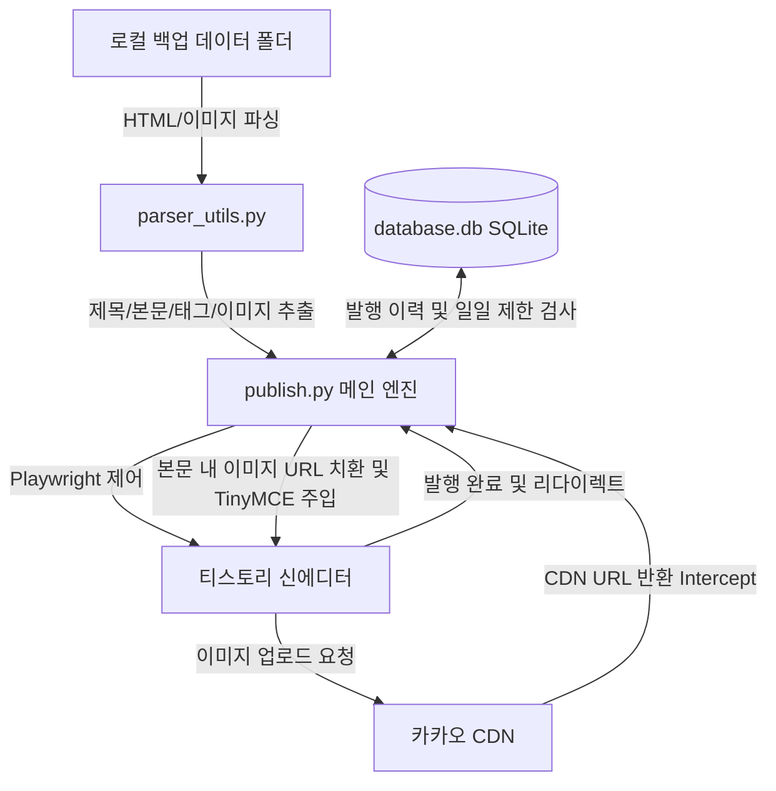
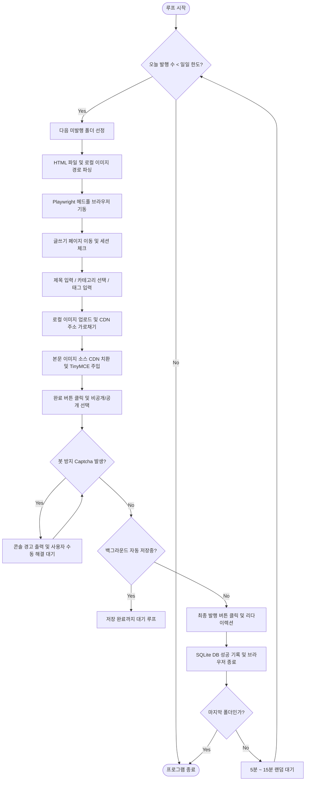

# 티스토리 백업 자동 업로드 시스템 아키텍처 및 로직 가이드

이 문서에서는 로컬 백업 데이터(HTML 및 이미지)를 티스토리 블로그에 안전하고 자동으로 업로드 및 발행하는 자동화 프로그램의 전체 구조와 세부 로직을 설명합니다.

---

## 1. 시스템 개요 (System Overview)

본 시스템은 과거 티스토리에서 백업한 HTML 게시글 및 로컬 이미지 폴더를 순차적으로 탐색하여, 최신 티스토리 신에디터 환경에 맞춰 포스팅을 자동 등록하는 Python/Playwright 기반 자동화 프로그램입니다.



---

## 2. 파일별 역할 (File Roles)

| 파일명 | 역할 설명 |
| :--- | :--- |
| **`login.py`** | 티스토리/카카오 수동 로그인을 최초 실행하여 쿠키 및 세션 정보가 담긴 브라우저 프로필(`user_data/`)을 영구 저장하는 스크립트 |
| **`publish.py`** | 자동 업로드 프로세스를 총괄하는 핵심 구동 엔진 (일일 제한 확인, 백업 폴더 루프, Playwright 브라우저 제어, 에디터 본문 주입 및 캡차 예외 처리) |
| **`parser_utils.py`** | 각 숫자로 된 백업 폴더 내부의 HTML 구조와 로컬 이미지 경로를 파싱하여 프로그램이 주입할 수 있는 정형 데이터로 변환하는 파서 모듈 |
| **`db_utils.py`** | SQLite 데이터베이스(`database.db`) 연동 유틸리티 (테이블 초기화, 중복 발행 검사, 일일 발행 횟수 제한 검사 및 이력 기록) |
| **`config.json`** | 블로그 정보, 일일 발행 개수 한도, 브라우저 화면 표시 여부(`headless`), 지연 시간(`delays`) 및 UI 셀렉터 등을 커스텀 정의하는 설정 파일 |

---

## 3. 프로그램 상세 구동 로직 Flow

`publish.py` 실행 시 작동하는 전체 상세 흐름은 다음과 같습니다.

### 3.1. 초기화 및 제한 검사 (Initialization)
1. **SQLite 데이터베이스 연결**: `database.db` 파일이 없으면 테이블을 자동으로 생성하고 접속합니다.
2. **일일 제한 확인**: 오늘 날짜 기준으로 성공적으로 발행 완료된 포스팅 수가 `config.json`의 `daily_limit` (기본 10개)에 도달했는지 검사합니다. 이미 10개 이상이면 즉시 종료합니다.
3. **미발행 폴더 수집**: 작업 디렉토리 내의 숫자명 폴더(예: `523`, `524` 등) 목록 중, 데이터베이스에 성공 이력이 등록되지 않은 폴더만 필터링하여 순서대로 수집합니다.

### 3.2. 포스팅 루프 시작 (Publishing Loop)
미발행 폴더 리스트를 돌며 아래 과정을 반복합니다 (최대 일일 제한 개수만큼 수행).



### 3.3. 핵심 자동화 제어 기법

#### ① 네트워크 응답 가로채기 (Network Interception)
- 이미지를 업로드할 때 발생하는 API 요청(`attach.json`)을 실시간 감시합니다.
- 카카오 서버가 가공 완료하여 반환하는 JSON 응답 `{ "name": "원본파일명.jpg", "url": "https://blog.kakaocdn.net/..." }`을 중간에 가로채서 `파일명 -> 카카오 CDN URL` 매핑 테이블을 구축합니다.
- HTML 본문에 포함되어 있던 로컬 상대 경로들을 해당하는 카카오 CDN URL로 안전하게 치환합니다.

#### ② 직접 에디터 렌더링 주입 (TinyMCE API)
- 텍스트 입력의 딜레이나 에디터 상태 동기화 누락을 원천 차단하기 위해, 브라우저 콘솔 컨텍스트 상에서 TinyMCE 글로벌 API를 호출하여 본문을 한 번에 주입합니다.
  ```javascript
  window.tinymce.activeEditor.setContent(processed_content);
  window.tinymce.activeEditor.setDirty(true);
  ```

#### ③ 봇 방지 문자(DKAPTCHA) 및 자동저장 예외 처리
- 글을 완성하고 발행용 서브밋을 하려고 하면 카카오 자체 봇 방지 시스템인 `DKAPTCHA` 모달이 발생할 수 있습니다.
- 프로그램은 `document.body.innerText`에 "DKAPTCHA" 혹은 "지도에서" 등의 텍스트가 노출되는지 실시간 루프 감시를 합니다.
- 감시 결과 캡차가 포착되면 콘솔 경고음을 울리며 사용자가 풀도록 대기하고, 사용자가 브라우저 창에서 마우스 클릭으로 캡차를 해결하여 모달이 닫히거나 포스팅 상세 주소(예: `/entry/...`)로 강제 이동되면 이를 즉시 감지하여 정상 처리 흐름으로 복귀합니다.
